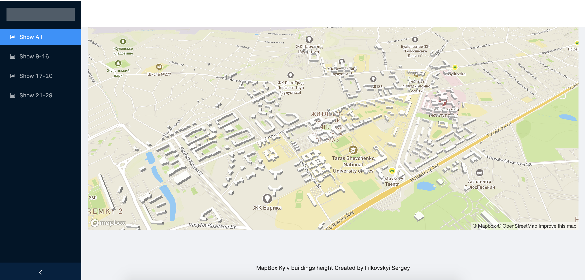

# Getting Started with Create React App

This project was bootstrapped with [Create React App](https://github.com/facebook/create-react-app).

# How to
## Warning!!! -  its important to checkout to `feature-buildings` branch first

1. Go to https://github.com/filkovskyi/map-design/tree/feature-buildings

2. `git clone git@github.com:filkovskyi/map-design.git`

3. `cd map-design`

4. `git checkout feature-buildings` branch

5. run `npm i` or `yarn install`

6. `run npm run start` or `yarn start`

# UI Example

